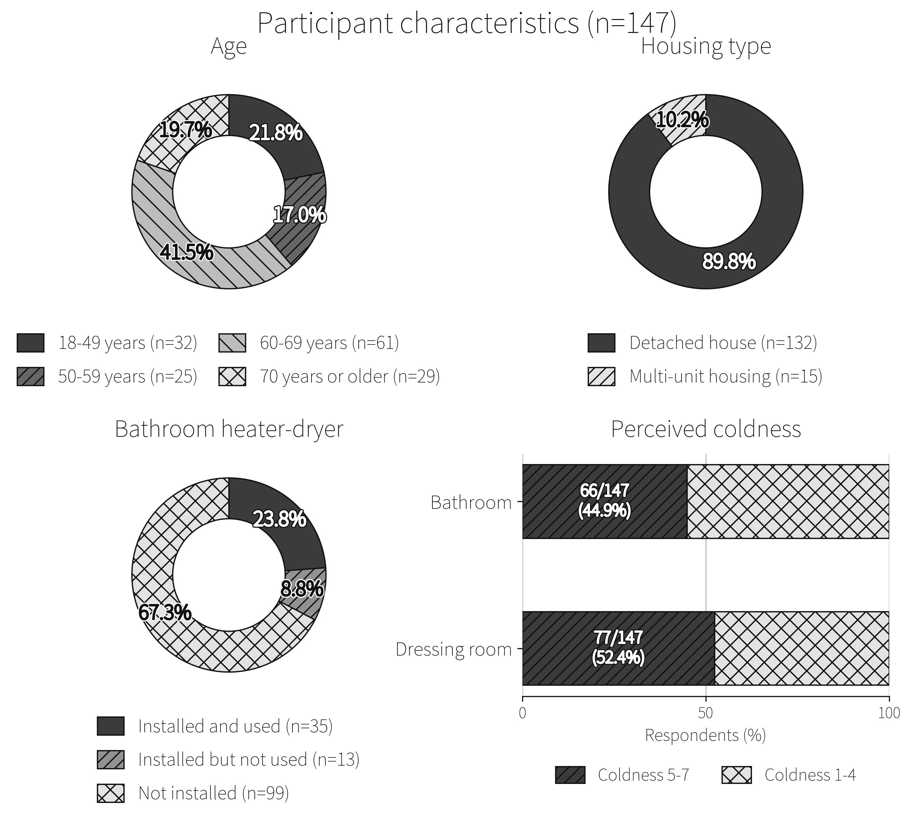
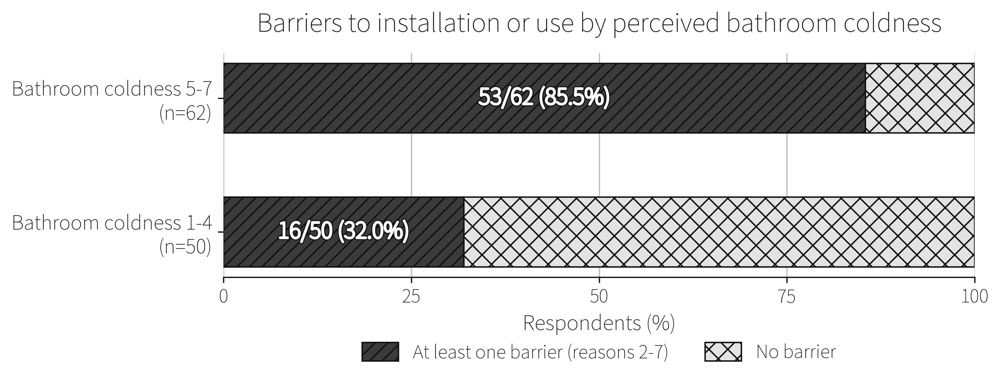
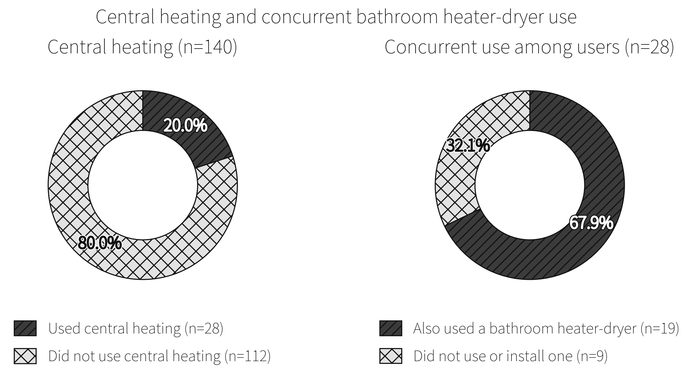

# 五所川原市でのアンケート調査における浴室暖房乾燥機の未設置・未使用理由と浴室の寒さ体感

## Title Page

- 論文種別: 短報
- 和文題名: 五所川原市でのアンケート調査における浴室暖房乾燥機の未設置・未使用理由と浴室の寒さ体感
- 著者: ［著者名を入力］
- 所属: ［所属を入力］
- 責任著者: ［氏名、所属、住所、電子メールアドレスを入力］
- ランニングタイトル: 五所川原市における浴室暖房の障壁

## 和文抄録

目的：前報の探索的解析で低い浴室暖房乾燥機設置率かつ高い標準化死亡比の寒冷県候補となった青森県において、未設置・未使用理由と浴室寒さ体感との関係を主に記述し、セントラル暖房の使用および浴室暖房乾燥機との併用を副次的に検討する。方法：2026年3月11日-4月30日に五所川原市内で無記名の横断質問紙調査を行った。190部を配布し154部を回収した。主要解析は147人、セントラル暖房別解析は140人を対象とし、割合のWilson 95%信頼区間（CI）と群間の割合差のNewcombe 95%CIを算出した。結果：浴室寒さ5-7群は66/147人（44.9%）であった。未使用・未設置112人では、「障壁あり」が69人（61.6%）、不要が31人（27.7%）であった。障壁ありは浴室寒さ5-7群で53/62人（85.5%）、寒さ1-4群で16/50人（32.0%）で、割合差は53.5パーセントポイント（95%CI [35.9, 66.6]）であった。セントラル暖房使用者は28/140人（20.0%）で、そのうち19/28人が浴室暖房乾燥機も使用していた。結論：便宜抽出標本内で、浴室を寒いと感じながら費用または設置上の制約を回答した者が観察された。セントラル暖房と浴室暖房乾燥機の併用も多く、単純な代替関係だけでは本標本の設備利用パターンを説明しにくかった。

キーワード：浴室暖房乾燥機、浴室寒さ、住環境、導入障壁、寒冷地

## I はじめに

本邦では、寒冷期に増加する入浴事故の防止は、公衆衛生上の重要な課題である[1]。前報では、浴室暖房乾燥機設置率が高いほどW65「浴槽内での溺死及び溺水」およびW66「浴槽への転落による溺死及び溺水」の死亡数が少ない方向の関連が、非寒冷県よりも寒冷県で強い可能性が示唆された[2]。探索的サブ解析では、浴室暖房乾燥機設置率が低く、標準化死亡比（SMR; 観測死亡数/期待死亡数）が高い寒冷県の候補として、青森県と秋田県が抽出された[2]。しかし、既存の広域集計からは、青森県における低設置率の背景や、浴室の寒さ体感、暖房設備の使用実態を把握できなかった。

そこで本研究では、青森県五所川原市内で配布した質問紙の便宜抽出標本を用い、浴室暖房乾燥機を設置していない、または使用していない回答者における理由の内訳と浴室寒さ体感との関係を主に記述することを目的とした。副次的に、セントラル暖房の使用状況および浴室暖房乾燥機との併用状況を記述した。

## II 方法

### 1. 研究デザインと対象

無記名自記式質問紙による横断研究を実施した。調査期間は2026年3月11日-4月30日であった。五所川原市在住の協力者が、原則として市内在住の18歳以上、1世帯1人を対象に、市内で質問紙を手渡し配布し、手渡しで回収した。これは協力者ネットワークによる便宜抽出であり、無作為抽出ではない。回答者の氏名、住所および連絡先は取得していないため、市内在住であることを個票単位では確認していない。

質問紙は200部を準備し、190部を配布した。10部は未配布であった。154部を回収し、36部は未回収であった。回収率は154/190（81.1%）であった。

### 2. 調査項目と変数

基本属性および住宅条件として、年代、住宅種別（一戸建て、集合住宅）、住居形態（持家、賃貸）、浴室窓（二重サッシ/複層ガラス、単板ガラス、窓なし、不明）を尋ねた。暖房設備および温熱環境として、浴室暖房乾燥機（設置して使用、設置しているが未使用、未設置）、セントラル暖房（24時間使用、時間限定使用、不使用）、冬季（1-2月の最も寒い時期）の脱衣所および浴室の寒さ体感を尋ねた。浴室暖房乾燥機を未使用または未設置と回答した者には、その理由を複数回答で尋ねた。

理由1「既に十分暖かいので必要がない」を「不要」とした。理由2「電気代が気になる」と理由3「設置費用が高い」を「費用系」、理由4「住宅の構造上、設置が難しい」と理由5「賃貸で工事できない」を「住宅・設置制約系」、理由6「使い方がわからない」と理由7「故障中で使えない」を「使用方法・故障系」とした。理由2-7のいずれかを選択した者を「障壁あり」とした。理由8は「その他」とした。複数回答のため、不要と障壁、および障壁分類間の重複を許した。

冬季の寒さ体感は、回答選択肢に1「非常に暖かい」から7「非常に寒い」を順に割り当て、5「やや寒い」、6「寒い」、7「非常に寒い」を寒さ5-7群、1-4を比較群とした。セントラル暖房は24時間使用または時間限定使用を「使用」、不使用を「不使用」とした。

### 3. 解析対象と統計解析

154部のうち、浴室暖房乾燥機の状況が無回答の3部と、未使用・未設置で理由が無回答の4部を除き、浴室寒さが回答された147部を解析対象とした。未使用・未設置理由の解析対象は112部であった。浴室暖房乾燥機を使用しているにもかかわらず理由欄にも回答した4部は、機器の使用状況を原回答どおり保持し、理由解析には含めなかった。セントラル暖房別の比較では無回答7部を除外し、140部を解析した。

カテゴリ変数は人数と割合で示し、割合の95%CIはWilson法で算出した。2群間の割合差は、寒さ群の比較では「寒さ5-7群 - 寒さ1-4群」、設備比較では「設備あり - 設備なし」とし、Newcombe-Wilson法による95%CIを算出した。副次解析として、セントラル暖房使用者における浴室暖房乾燥機の使用有無を人数、割合および95%CIで示した。調整回帰およびp値による評価は行わなかった。解析にはPython 3.11.3、pandas 2.2.3およびmatplotlib 3.10.8を用いた。

### 4. 倫理的配慮

回答は任意かつ無記名とし、調査目的、回答拒否または中断による不利益がないこと、データの利用・保管方法を質問紙表紙に記載した。回答済み質問紙の提出をもって研究参加への同意とした。本研究は日本温泉気候物理医学会倫理審査会の承認を受けた（承認日2026年3月11日、承認番号Onki26-01）。

## III 結果

### 1. 回答者と住環境

解析対象147人のうち、60-69歳が61人（41.5%）、70歳以上が29人（19.7%）であった。一戸建てが132人（89.8%）、持家が130人（88.4%）、築30年以上が77人（52.4%）であった。浴室暖房乾燥機を設置して使用していた者は35人（23.8%）、設置しているが使用していない者は13人（8.8%）、未設置は99人（67.3%）であった。浴室寒さ5-7群は66/147人（44.9%、95%CI [37.1, 53.0]）、脱衣所寒さ5-7群は77/147人（52.4%、95%CI [44.4, 60.3]）であった（Fig. 1）。

&lt;Fig. 1 here&gt;

### 2. 未設置・未使用理由と浴室寒さ

未使用・未設置112人のうち、障壁ありは69人（61.6%、95%CI [52.4, 70.1]）、不要は31人（27.7%、95%CI [20.2, 36.6]）であった。障壁の内訳は、費用系41人（36.6%）、住宅・設置制約系27人（24.1%）、使用方法・故障系3人（2.7%）であった。不要と障壁の両方を選択した者は3人、費用系と住宅・設置制約系の両方を選択した者は2人であり、その他の障壁分類間に重複はなかった。

障壁ありは、浴室寒さ5-7群で53/62人（85.5%、95%CI [74.7, 92.2]）、寒さ1-4群で16/50人（32.0%、95%CI [20.8, 45.8]）であった。割合差は53.5パーセントポイント（95%CI [35.9, 66.6]）であった（Fig. 2）。一方、不要は寒さ5-7群で4/62人（6.5%、95%CI [2.5, 15.5]）、寒さ1-4群で27/50人（54.0%、95%CI [40.4, 67.0]）で、割合差は-47.6パーセントポイント（95%CI [-61.2, -31.2]）であった。費用系の割合差は30.0パーセントポイント（95%CI [12.2, 44.9]）、住宅・設置制約系は21.9パーセントポイント（95%CI [6.1, 35.8]）であった。

&lt;Fig. 2 here&gt;

### 3. 暖房設備の利用状況

セントラル暖房に回答した140人のうち、使用者は28人（20.0%、95%CI [14.2, 27.4]）であった。使用者28人のうち、浴室暖房乾燥機を使用していた者は19人（67.9%、95%CI [49.3, 82.1]）、設置しているが未使用または未設置の者は9人（32.1%、95%CI [17.9, 50.7]）であった（Fig. 3）。

浴室暖房乾燥機の不使用者では浴室寒さ5-7群が62/112人（55.4%、95%CI [46.1, 64.2]）であったのに対し、使用者では4/35人（11.4%、95%CI [4.5, 26.0]）であり、割合差（使用者-不使用者）は-43.9パーセントポイント（95%CI [-55.2, -26.7]）であった。セントラル暖房の不使用者では61/112人（54.5%、95%CI [45.3, 63.4]）、使用者では2/28人（7.1%、95%CI [2.0, 22.7]）であり、割合差（使用者-不使用者）は-47.3パーセントポイント（95%CI [-57.6, -29.3]）であった。これらは未調整の横断比較であり、設備による寒さ改善効果を示すものではない。

&lt;Fig. 3 here&gt;

## IV 考察

本調査の主要所見は、浴室暖房乾燥機の未使用・未設置者では、費用や住宅・設置上の制約を含む障壁の選択が多く、特に浴室寒さ5-7群でその割合が大きかったことである。未使用・未設置者のうち、「障壁あり」の割合は、寒さ1-4群の32.0%に対し、寒さ5-7群では85.5%であり、割合差は53.5パーセントポイント（95%CI [35.9, 66.6]）であった。したがって、本標本では、浴室を寒いと認識しながら、費用または住宅・設置上の制約を回答した未使用・未設置者が観察された。

寒冷期の入浴では、居間から脱衣所を経て浴室へ移動する際に、温熱環境が大きく変化し得る。青森・秋田を含む地域の調査では、寒冷期に入浴中心肺停止が増加し、その発生には脱衣場・浴室内の低温が関係している可能性が考察されている[1]。しかし、同報告では、浴室暖房乾燥機およびセントラル暖房の設置・使用状況は扱われていなかった。

北海道については、前報で参照した公的集計でセントラル暖房使用率が24.6%と、他地域の0.4-4.0%より高かった[2]。八塚らの全国調査では、北海道は冬期非暖房時の浴室を「寒い」または「非常に寒い」と回答した者の割合が他地域より顕著に小さかった[3]。また、大中らによる全国11都市の住宅実測では、札幌では全室暖房を背景に居間以外も比較的高温に保たれ、室間温度差が小さいことが報告されている[4]。これらの知見から、北海道では、セントラル暖房を含む全館暖房が浴室周辺を暖め、浴室暖房乾燥機を代替している可能性が考えられる。

一方、青森県については、セントラル暖房使用率は東北地方単位の集計[2]、浴室寒さ体感は北東北ブロック単位の集計[3]に限られ、県単独の実態は明らかでなかった。前報では、青森県も北海道と同様に寒冷な地域であることから、セントラル暖房が浴室暖房乾燥機を代替しているという仮説を提示したが、既存の広域集計からこの仮説を検証することは困難であった[2]。

本調査では、セントラル暖房使用者28人のうち19人が浴室暖房乾燥機も使用しており、併用が多く観察された。したがって、少なくとも本標本の設備利用パターンは、セントラル暖房と浴室暖房乾燥機の単純な排他的代替だけでは説明しにくかった。

費用系は未使用・未設置者の36.6%、住宅・設置制約系は24.1%が選択した。啓発のみでは対応しにくいこれらの回答は、設備導入を個人の必要性認識だけで説明できない可能性を示す。寒冷地の浴室温熱環境を検討する際には、電気代や設置費用に加え、既存住宅の構造、賃貸住宅での工事制約、個別設備以外の暖房方式も区別して把握する必要がある。

本研究は協力者ネットワークによる便宜抽出で、回答者住所も確認していないため、標本は五所川原市の成人を代表しない。横断的な自己申告調査で、室温実測や交絡調整を行っていないため、暖房設備による寒さ改善効果は推定できない。未設置・未使用理由は複数回答で主たる理由を特定できず、入浴事故も調査していないため、その関連や予防効果は評価できない。以上から、所見は本標本内の記述的な関連として解釈する必要がある。

## V 結論

五所川原市内で配布した質問紙の便宜抽出標本では、浴室暖房乾燥機を未使用または未設置の回答者に、浴室を寒いと感じながら費用または住宅・設置上の制約を抱える者が観察された。セントラル暖房使用者では浴室暖房乾燥機との併用が多く、単純な代替関係だけでは本標本の設備利用パターンを説明しにくかった。低設置率の背景を検討するには、併用を含む住宅設備構成を把握する必要がある。

## 謝辞

本調査に回答いただいた皆様、ならびに質問紙の配布・回収に協力いただいた皆様に深謝する。

## 利益相反

開示すべき利益相反はない。本研究は実施責任者の自己負担で行われ、外部研究費の提供を受けていない。

## 引用文献

1. 重臣宗伯，佐藤ワカナ，柴田繁啓，他：高齢者の入浴中心肺停止と地域性．蘇生 20：145-148，2001．doi:10.11414/jjreanimatology1983.20.145
2. 野城聡志：寒冷地における浴室暖房乾燥機設置率と浴槽内での溺死及び溺水の関連：生態学的パネル解析．日本温泉気候物理医学会雑誌 89：66-76，2026．doi:10.11390/onki.2376
3. 八塚春子，井上隆，前真之，森勇樹：浴室設備と冬期における入浴・浴室温熱環境の実態把握―インターネット調査による地域・建築形態・築年数の検討．日本建築学会環境系論文集 78：489-496，2013．doi:10.3130/aije.78.489
4. 大中忠勝，高崎裕治，栃原裕，他：冬期における浴室温熱環境の全国調査．人間と生活環境 14：11-16，2007．doi:10.24538/jhesj.14.1_11

## English Title

Reasons for Non-installation or Non-use of Bathroom Heater-Dryers and Perceived Bathroom Coldness in a Questionnaire Survey in Goshogawara City, Japan

- Authors: [Enter author names in Roman letters]
- Affiliations: [Enter affiliations in English]
- Corresponding author: [Enter name, affiliation, postal address, telephone number, and email address]

## English Abstract

Objective: Following an exploratory ecological analysis that identified Aomori as a candidate cold prefecture with a low bathroom heater-dryer installation rate and a high standardized mortality ratio, we primarily described reasons for non-installation or non-use and their relationship with perceived bathroom coldness. Secondarily, we described central heating use and concurrent bathroom heater-dryer use. Methods: We conducted an anonymous cross-sectional questionnaire survey in Goshogawara City, Japan, from March 11 to April 30, 2026. Of 190 questionnaires distributed, 154 were returned. The primary analysis included 147 respondents, and the central heating analysis included 140 respondents. Wilson 95% confidence intervals (CIs) were calculated for proportions, and Newcombe 95% CIs were calculated for differences in proportions. Results: Overall, 66/147 respondents (44.9%) reported bathroom coldness scores of 5-7. Among 112 respondents who did not use or had not installed a bathroom heater-dryer, 69 (61.6%) selected at least one barrier, whereas 31 (27.7%) selected that heating was unnecessary. Barriers were selected by 53/62 respondents (85.5%) in the coldness 5-7 group and 16/50 (32.0%) in the coldness 1-4 group, a difference of 53.5 percentage points (95% CI [35.9, 66.6]). Central heating was used by 28/140 respondents (20.0%), of whom 19/28 also used a bathroom heater-dryer. Conclusions: Within this convenience sample, some respondents perceived their bathrooms as cold while reporting cost-related or installation-related constraints. Frequent concurrent use of central heating and bathroom heater-dryers suggested that a simple substitution relationship alone did not explain the equipment-use pattern in this sample. These findings do not estimate citywide prevalence or establish effects of heating equipment on coldness or bathing-related health outcomes.

English keywords: bathroom heater-dryer; bathroom coldness; residential environment; adoption barriers; cold climate

## Figures

### Figure 1

{width=95%}&nbsp;

### Figure 2

{width=95%}&nbsp;

### Figure 3

{width=95%}&nbsp;

## Figure Legends

### Figure 1. Participant and housing characteristics

The panels show age, housing type, bathroom heater-dryer installation and use status, and perceived coldness in the bathroom and dressing room. Percentages use all 147 respondents as the denominator. Coldness scores of 5-7 correspond to "somewhat cold," "cold," or "very cold."

### Figure 2. Barriers to installation or use by perceived bathroom coldness

The analysis includes 112 respondents who had not installed or did not use a bathroom heater-dryer. At least one barrier was defined as selection of any reason from 2 to 7. Reasons were collected as multiple responses. The coldness 5-7 and coldness 1-4 groups included 62 and 50 respondents, respectively.

### Figure 3. Central heating use and concurrent bathroom heater-dryer use

The left panel includes 140 respondents who provided information on central heating use; 7 respondents with missing information were excluded. The right panel is restricted to the 28 central heating users. Respondents who had installed but did not use a bathroom heater-dryer and those who had not installed one were classified as not concurrently using one.
