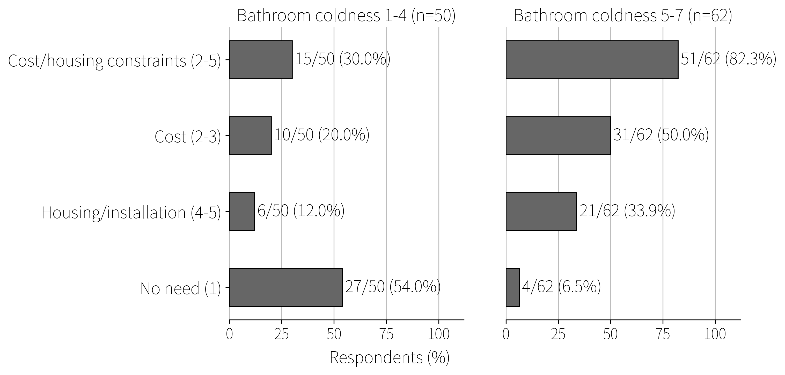

# 青森県五所川原市における浴室暖房乾燥機の未設置・未使用理由と浴室の温冷感

## Title Page

- 論文種別: 短報
- 和文題名: 青森県五所川原市における浴室暖房乾燥機の未設置・未使用理由と浴室の温冷感
- 著者: ［著者名を入力］
- 所属: ［所属を入力］
- 責任著者: ［氏名、所属、住所、電子メールアドレスを入力］
- ランニングタイトル: 浴室暖房乾燥機の未設置・未使用理由と浴室の温冷感

## 和文抄録

目的：青森県五所川原市内で実施した質問紙調査から得た便宜抽出標本を用い、浴室暖房乾燥機を設置していない者、または設置しているが暖房として使用していない者（以下、不使用者）が挙げた理由の内訳を、冬季の浴室の寒さ体感別に記述することを主目的とした。副次的に、セントラル暖房の使用状況および浴室暖房乾燥機との併用状況を記述した。方法：2026年3月11日-4月30日に五所川原市内で無記名の横断質問紙調査を行った。190部を配布し154部を回収した。浴室暖房乾燥機の設置・使用状況が無回答の3人と、不使用者のうち理由が無回答の4人を除く147人を主要解析対象とし、このうち不使用者112人を理由解析対象とした。セントラル暖房については、回収した154部のうち同項目への回答が得られた145人を対象とした。冬季（1-2月の最も寒い時期）の浴室の寒さ体感は、1「非常に暖かい」と7「非常に寒い」を両端とする7件法で尋ね、解析前に1-4群と5-7群に区分した。未設置・未使用理由（複数回答）については、「電気代」「設置費用」「住宅構造」「賃貸による工事制約」のいずれかを選択した者を、回答回収後に探索的に「費用または住宅・設置上の制約」と集約し、人数と割合を記述した。結果：理由解析対象となった不使用者112人の内訳は、浴室寒さ5-7群62人、浴室寒さ1-4群50人であった。費用または住宅・設置上の制約を選択した者は、浴室寒さ5-7群で51/62人（82.3%）、浴室寒さ1-4群で15/50人（30.0%）であった。セントラル暖房使用者は28/145人（19.3%）で、そのうち19/28人（67.9%）が浴室暖房乾燥機を暖房として使用していた。結論：五所川原市内の便宜抽出標本では、浴室を寒いと感じる浴室暖房乾燥機の不使用者のうち、費用または住宅・設置上の制約を不使用理由として回答した者が観察された。寒冷地の浴室対策を検討する際には、設備の必要性だけでなく、導入・使用を妨げる具体的制約と住宅の暖房構成を把握することも、今後の検討課題となる。

キーワード：浴室暖房乾燥機、セントラル暖房、横断研究、寒冷地、青森県

## I はじめに

本邦において、冬季に多発する入浴中の事故の防止は、公衆衛生上の重要な課題である[1,2]。前報では、浴室暖房乾燥機設置率が高いほど、W65「浴槽内での溺死及び溺水」およびW66「浴槽への転落による溺死及び溺水」の死亡数が少ないという方向の関連が、非寒冷県よりも寒冷県で強い可能性が示唆された[3]。探索的サブ解析では、浴室暖房乾燥機設置率が低く、標準化死亡比（SMR; 観測死亡数/期待死亡数）が高い寒冷県の1つとして、青森県が抽出された[3]。しかし、既存の広域集計からは、青森県における低設置率の背景、浴室の寒さ体感、および暖房設備の使用実態を把握することはできなかった。

そこで本研究では、青森県五所川原市内で配布した質問紙の便宜抽出標本を用い、浴室暖房乾燥機を設置していない、または使用していない回答者が挙げた理由の内訳を、浴室の寒さ体感別に記述することを目的とした。副次的に、セントラル暖房の使用状況および浴室暖房乾燥機との併用状況を記述した。

## II 方法

### 1. 研究デザインと対象

無記名自記式質問紙による横断研究を実施した。調査期間は2026年3月11日-4月30日で、五所川原市内の現地協力者1名の協力を得た。配布対象は五所川原市在住の18歳以上とし、原則として1世帯につき1人とした。現地協力者が自身の人的ネットワークを通じて、五所川原市内で質問紙を手渡しで配布・回収した。標本は便宜抽出であり、無作為抽出ではなかった。回答者の氏名、住所および連絡先は取得しなかった。居住地は質問項目に含めておらず、個票単位での居住地確認は行わなかった。

事前の運用計画では、有効回答80部以上を確保するため、目標回収数を100部とした。調査開始時に200部を準備して現地協力者へ渡し、そのうち190部が配布された。154部を回収し、配布票回収率は154/190（81.1%）であった。

### 2. 調査項目と変数

回答者の基本属性、住宅条件、冬季の自宅入浴頻度、暖房設備、ならびに冬季の脱衣所および浴室の寒さ体感を尋ねた。浴室暖房乾燥機の設置および暖房としての使用状況を「設置して使用」「設置しているが未使用」「未設置」で尋ね、後二者を合わせて「不使用者」と定義した。不使用者には未設置・未使用理由を複数回答で尋ねた。質問票では、セントラル暖房を「1か所の熱源で作った温水を配管で各室へ送り、パネルヒーター、ファンコンベクターまたは床暖房などで住宅全体を暖める方式」と説明し、使用状況を「24時間使用」「時間限定使用」「不使用」で尋ねた。また、浴室暖房乾燥機およびセントラル暖房以外に、脱衣所・浴室のその他暖房設備として、ストーブ、エアコン、セントラル暖房の一部ではない床暖房、その他、使用なしを複数回答で尋ねた。

浴室暖房乾燥機の未設置・未使用理由のうち、理由1「既に十分暖かいので必要がない」を「不要」とした。理由2「電気代が気になる」と理由3「設置費用が高い」を「費用系」、理由4「住宅の構造上、設置が難しい」と理由5「賃貸で工事できない」を「住宅・設置制約系」とした。理由6「使い方がわからない」、理由7「故障中で使えない」および理由8「その他」は、原選択肢別に記述した。回答回収後に設定した探索的な集約分類として、理由2-5のいずれかを選択した者を「費用または住宅・設置上の制約」、理由2-7のいずれかを選択した者を「障壁あり」とした。理由8のみを選択した者を「その他のみ」として記述した。複数回答であるため、「不要」と「障壁あり」の重複、および「費用系」と「住宅・設置制約系」の重複を許容した。未設置・未使用理由および脱衣所・浴室のその他暖房設備の「その他」に記載された自由記述は、内容分析または回答選択肢への再分類を行わなかった。

冬季（1-2月の最も寒い時期）の寒さ体感は、1「非常に暖かい」、4「どちらでもない」、7「非常に寒い」を両端と中立点とする7件法で尋ねた。解析前に定めた区分により、5-7を寒さ5-7群、1-4を寒さ1-4群とした。セントラル暖房は24時間使用または時間限定使用を「使用」、不使用を「不使用」とした。

### 3. 解析対象と統計解析

154部のうち、浴室暖房乾燥機の設置および暖房としての使用状況が無回答の3部と、不使用者のうち理由が無回答の4部を除いた147部を主要解析対象とした。このうち不使用者112部を理由解析の対象とした。浴室暖房乾燥機を暖房として使用しながら理由欄にも回答した4部は、使用状況を原回答のまま扱い、理由解析には含めなかった。セントラル暖房の使用状況は、回収した154部のうち同項目に回答した145部を対象に集計した。セントラル暖房使用者における浴室寒さおよび浴室暖房乾燥機との併用は、各項目が利用可能な回答を用いて記述した。欠測値の補完は行わなかった。

Table 1では、年齢を18-49歳、50-59歳、60-69歳、70歳以上、築年帯を30年未満、30年以上、不明に集約し、浴室窓の「わからない」と無回答を「不明・無回答」にまとめた。脱衣所・浴室のその他暖房設備は主要解析対象147人を分母とする複数回答として集計し、無回答を別に示した。

カテゴリ変数は人数と割合で示した。未設置・未使用理由は、不使用者112人を分母として8つの選択肢別および集約分類別に記述した。浴室寒さ1-4群と浴室寒さ5-7群別には、費用または住宅・設置上の制約、費用系、住宅・設置制約系および不要の4分類をFig. 1に示した。セントラル暖房使用者については、浴室寒さ5-7群の人数および浴室暖房乾燥機の併用人数を記述した。解析および作図にはPython 3.11.3を用いた。

### 4. 倫理的配慮

回答は任意かつ無記名とし、調査の目的、回答の拒否または中断によって不利益が生じないこと、ならびにデータの利用・保管の方法を質問紙の表紙に記載した。回答済み質問紙の提出をもって研究参加への同意とした。本研究は日本温泉気候物理医学会倫理審査会の承認を受けた後に調査を開始した（承認日2026年3月11日、承認番号Onki26-01）。

## III 結果

### 1. 回答者と住環境

154部の回収票から7部を除外し、147人を主要解析対象とした。対象者の特性をTable 1に示す。浴室寒さ5-7群は66人（44.9%）、脱衣所寒さ5-7群は77人（52.4%）であった。

&lt;Table 1 here&gt;

### 2. 暖房設備の利用状況

浴室暖房乾燥機、セントラル暖房および脱衣所・浴室のその他暖房設備の利用状況をTable 1に示す。セントラル暖房の使用状況に回答した145人中28人（19.3%）が使用していた。この28人のうち、浴室寒さ5-7群は2人（7.1%）で、19人（67.9%）は浴室暖房乾燥機を暖房として使用していた。

### 3. 浴室暖房乾燥機の未設置・未使用理由と浴室寒さ

不使用者112人のうち、障壁あり（理由2-7のいずれか）は69人（61.6%）、費用または住宅・設置上の制約（理由2-5のいずれか）は66人（58.9%）であった。

選択肢別の回答（複数回答）は、不要31人（27.7%）、電気代25人（22.3%）、設置費用22人（19.6%）であった。住宅構造上の制約は19人（17.0%）、賃貸による工事制約は8人（7.1%）、使用方法不明は2人（1.8%）、故障中は1人（0.9%）、その他は17人（15.2%）であった。理由8「その他」のみを選択した者は15人（13.4%）で、不要と障壁ありの両方を選択した者は3人（2.7%）であった。

費用または住宅・設置上の制約は、浴室寒さ5-7群で51/62人（82.3%）、浴室寒さ1-4群で15/50人（30.0%）が選択した。不要は、浴室寒さ5-7群で4/62人（6.5%）、浴室寒さ1-4群で27/50人（54.0%）が選択した。費用系および住宅・設置制約系の内訳を含め、Fig. 1に示す。

&lt;Fig. 1 here&gt;

## IV 考察

本調査で注目された所見は、浴室を寒いと感じる不使用者62人のうち、51人（82.3%）が費用または住宅・設置上の制約を選択したことである。この51人のうち、費用系は31人、住宅・設置制約系は21人で、1人が両方を選択していた。このような回答が観察されたことから、浴室の寒さ対策を検討する際には、設備の必要性に関する周知に加えて、使用費、設置費および住宅側の工事制約を把握することも、今後の検討課題となる。

前報において、環境省「令和5年度家庭部門のCO2排出実態統計調査」の公開表を用いて集計したセントラル暖房使用率は、北海道地域で24.6%であり、他地域の0.4-4.0%より高かった[3]。北海道では浴室の寒さや室間温度差も他地域より小さく[4,5]、前報では、セントラル暖房を含む全館暖房が浴室暖房乾燥機を代替し得る可能性に言及した[3]。一方、青森県では、重臣らが入浴中心肺停止の地域差と寒冷期の脱衣場・浴室内低温との関連を指摘しているものの[6]、浴室周辺の寒さ・室間温度差を県単位で示した報告や、浴室暖房乾燥機・セントラル暖房の設置・使用実態を調べた報告は、今回確認した公開情報の範囲では見当たらなかった。この情報不足を踏まえて実施した本調査では、セントラル暖房の使用状況に回答した145人中28人が使用しており、その28人のうち浴室寒さ5-7群は2人、浴室暖房乾燥機を併用していた者は19人であった。こうした観察事実から、少なくとも本標本の設備利用パターンは、「浴室が暖かいため不要」という理由や、セントラル暖房による単純な排他的代替だけでは説明しにくかった。

本研究には限界がある。理由1「既に十分暖かいので必要がない」は、それ自体が寒さ体感に関する判断を含む項目である。このため、寒さ体感群間の「不要」の割合差を独立した所見として解釈することはできない。「不要」を選択した者のうち3人は理由2-7のいずれかも選択しており、「不要」と「障壁あり」は相互排他的ではない。また、横断調査であるため、寒さ体感別の障壁回答割合から、障壁の認識と寒さ体感の前後関係は判断できない。逆に、寒さを感じる者ほど障壁を認識し、該当する理由を選択しやすかった可能性もある。標本は便宜抽出であり、五所川原市および青森県全体を代表するものではない。自己申告に伴う想起誤差や回答誤差が生じ得るほか、断熱性能、築年、所有形態などによる交絡も残る。さらに、セントラル暖房が浴室や脱衣所を実際に暖めていたかは確認しておらず、入浴中の事故の発生も調査していない。以上から、青森県全体における浴室暖房乾燥機とセントラル暖房の代替関係、暖房設備による寒さ体感の改善効果、および暖房設備と入浴中の事故との関連は評価できない。

## V 結論

五所川原市内の便宜抽出標本では、浴室を寒いと感じる浴室暖房乾燥機の不使用者のうち、費用または住宅・設置上の制約を不使用理由として回答した者が観察された。寒冷地の浴室対策を検討する際には、設備の必要性だけでなく、導入・使用を妨げる具体的制約と住宅の暖房構成を把握することも、今後の検討課題となる。

## 謝辞

本調査に回答いただいた皆様、ならびに質問紙の配布・回収に協力いただいた現地協力者に深謝する。

## 利益相反

開示すべき利益相反はない。本研究は実施責任者の自己負担で行われ、外部研究費の提供を受けていない。

## 引用文献

1. Kiyohara K, Nishiyama C, Hayashida S, et al：Characteristics and outcomes of bath-related out-of-hospital cardiac arrest in Japan．Circ J 80：1564-1570，2016．doi:10.1253/circj.CJ-16-0241
2. 消費者庁：冬季に多発する入浴中の事故に御注意ください！―11月26日は「いい風呂」の日―．2018．https://www.caa.go.jp/policies/policy/consumer_safety/caution/caution_009/pdf/caution_009_181121_0001.pdf
3. 野城聡志：寒冷地における浴室暖房乾燥機設置率と浴槽内での溺死及び溺水の関連：生態学的パネル解析．日本温泉気候物理医学会雑誌 89：66-76，2026．doi:10.11390/onki.2376
4. 八塚春子，井上隆，前真之，森勇樹：浴室設備と冬期における入浴・浴室温熱環境の実態把握―インターネット調査による地域・建築形態・築年数の検討．日本建築学会環境系論文集 78：489-496，2013．doi:10.3130/aije.78.489
5. 大中忠勝，高崎裕治，栃原裕，他：冬期における浴室温熱環境の全国調査．人間と生活環境 14：11-16，2007．doi:10.24538/jhesj.14.1_11
6. 重臣宗伯，佐藤ワカナ，柴田繁啓，他：高齢者の入浴中心肺停止と地域性．蘇生 20：145-148，2001．doi:10.11414/jjreanimatology1983.20.145

## English Title

Reasons for Non-installation or Non-use of Bathroom Heating Dryers and Perceived Thermal Sensation in the Bathroom in Goshogawara City, Aomori Prefecture

- Authors: [Enter author names in Roman letters]
- Affiliations: [Enter affiliations in English]
- Corresponding author: [Enter name, affiliation, postal address, and email address]

## English Abstract

Objective: We used a convenience sample from a questionnaire survey in Goshogawara City, Aomori Prefecture, primarily to describe the distribution of reasons reported by respondents who had not installed a bathroom heating dryer or had installed one but did not use it for heating (hereafter, non-users), stratified by perceived bathroom coldness in winter. Secondarily, we described central heating use and its concurrent use with a bathroom heating dryer. Methods: We conducted an anonymous cross-sectional questionnaire survey in Goshogawara City from March 11 to April 30, 2026. Of 190 distributed questionnaires, 154 were returned. We excluded three respondents with missing data on bathroom heating dryer installation/use status and four non-users who did not report a reason for non-use, leaving 147 respondents for the primary analysis; 112 non-users were included in the analysis of reasons. Central heating analyses included 145 of 154 respondents with non-missing data on that item. Perceived thermal sensation in the bathroom during the coldest winter period (January-February) was rated on a 7-point scale from 1 (very warm) to 7 (very cold). Ratings were classified a priori into bathroom coldness score groups of 1-4 and 5-7. Reasons for non-installation or non-use were collected as multiple responses. After data collection, we created an exploratory post hoc category, "cost-related or housing/installation-related constraints," for respondents selecting at least one of four reasons: concern about electricity costs, high installation cost, difficulty of installation because of housing structure, or inability to undertake construction work in rented housing. Counts and percentages are reported. Results: Among 112 non-users, 62 were in the bathroom coldness score 5-7 group and 50 were in the bathroom coldness score 1-4 group. Cost-related or housing/installation-related constraints were selected by 51/62 respondents (82.3%) in the bathroom coldness score 5-7 group and by 15/50 (30.0%) in the bathroom coldness score 1-4 group. Central heating was used by 28/145 respondents (19.3%), of whom 19 (67.9%) also used a bathroom heating dryer for heating. Conclusions: In this convenience sample from Goshogawara City, some non-users of bathroom heating dryers who perceived their bathrooms as cold reported cost-related or housing/installation-related constraints as reasons for non-installation or non-use. When measures to address bathroom coldness in cold regions are considered, understanding the specific constraints that impede equipment installation or use and the heating configuration of the home, in addition to the need for such equipment, remains a matter for future investigation.

English keywords: bathroom heating dryer; central heating; cross-sectional study; cold region; Aomori Prefecture

## Tables

### Table 1. Characteristics and use of heating equipment in the primary analysis sample (n = 147)

| Characteristic | Category | n (%) | Characteristic | Category | n (%) |
| --- | --- | ---: | --- | --- | ---: |
| Age | 18-49 years | 32 (21.8) | Bathroom window | Double window/double glazing | 111 (75.5) |
| | 50-59 years | 25 (17.0) | | Single glazing | 26 (17.7) |
| | 60-69 years | 61 (41.5) | | No window | 7 (4.8) |
| | ≥70 years | 29 (19.7) | | Unknown/missing | 3 (2.0) |
| Housing type | Detached house | 132 (89.8) | Bathroom heating dryer | Installed and used for heating | 35 (23.8) |
| | Apartment/condominium | 15 (10.2) | | Installed but not used for heating | 13 (8.8) |
| Building age | &lt;30 years | 62 (42.2) | | Not installed | 99 (67.3) |
| | ≥30 years | 77 (52.4) | Central heating | Used 24 h/day (continuous) | 16 (11.0) |
| | Unknown | 8 (5.4) | | Used for limited hours | 12 (8.3) |
| Housing tenure | Owner-occupied | 130 (88.4) | | Not used | 117 (80.7) |
| | Rented | 16 (10.9) | | Missing | 9 |
| | Missing | 1 (0.7) | Other equipment used to heat the dressing room or bathroom | Space heater (stove) | 63 (42.9) |
| Frequency of bathing at home in winter | Daily | 94 (63.9) | | Air conditioner | 15 (10.2) |
| | 4-6 times/week | 36 (24.5) | | Floor heating not part of the central heating system | 2 (1.4) |
| | 1-3 times/week | 10 (6.8) | | Other | 4 (2.7) |
| | 1-3 times/month | 2 (1.4) | | None | 61 (41.5) |
| | Almost never | 5 (3.4) | | Missing | 8 (5.4) |
| | | | Perceived bathroom coldness | Coldness score 5-7 | 66 (44.9) |
| | | | Perceived dressing-room coldness | Coldness score 5-7 | 77 (52.4) |

Values are n (%). For central heating use, 145 of the 154 returned questionnaires had non-missing data; the nine missing responses are shown separately. Percentages for all other characteristics were calculated with all 147 respondents in the primary analysis as the denominator. Use of other equipment to heat the dressing room or bathroom, excluding the bathroom heating dryer and central heating, was assessed with a multiple-response item; therefore, percentages do not sum to 100%, and missing responses are shown separately. Perceived thermal sensation in the bathroom and dressing room was rated on a 7-point scale from 1 (very warm) to 7 (very cold); for each room, only the derived coldness score 5-7 group is shown.

## Figure Legends

### Fig. 1. Reasons for non-installation or non-use of a bathroom heating dryer, by perceived bathroom coldness

The analysis included 112 respondents who had not installed a bathroom heating dryer or who had installed one but did not use it for heating. The left and right panels show the bathroom coldness score 1-4 group (n = 50) and the bathroom coldness score 5-7 group (n = 62), respectively; both panels use the same axis scale and bar style. Reasons were collected as multiple responses; therefore, percentages do not sum to 100%. "No need" (reason 1) corresponds to the response option "The bathroom is already warm enough, so a bathroom heating dryer is not needed." Cost-related or housing/installation-related constraints comprise reasons 2-5 (electricity costs, installation cost, housing structure, and inability to carry out construction work in rented housing); cost-related reasons comprise reasons 2 and 3; and housing/installation-related reasons comprise reasons 4 and 5. Because the cost-related and housing/installation-related categories were not mutually exclusive, the sum of their counts does not equal the count for the combined category. Bars show the observed n/N (%) within each group. Confidence intervals are not shown, and no statistical tests of between-group differences were performed.

## Figures

### Figure 1

{width=100%}&nbsp;
